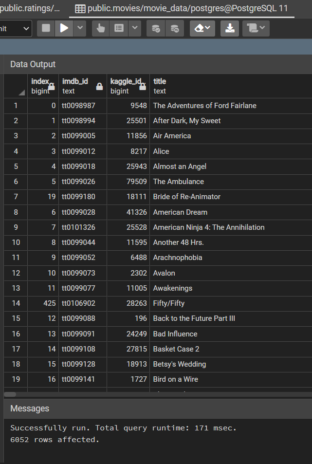

# Movies_ETL  

## Overview of Project  

**Purpose:**  
Amazing Prime, a movie and tv streaming platform, decided to host a hackathon to predict popular movies. Britta, who works for Amazing Prime, was tasked to create a database from Wikipedia for movies released since 1990 and ratings data from Movielens. We are to extract the data, transform the data to a clean the dataset, and load the data into SQL tables.  

## Resources:  
- Data Source: movies_metadata.csv, ratings.csv, wikipedia-movies.json  
- Software: Python 3.9.7, Jupyter Notebook 6.4.5, pgAdmin 4  

## Analysis and Results  

**Analysis:**  
For this analysis, we extracted data from 3 different data files. The cleaning process had multiple steps to it from removing duplicates, changing the format of the data so they are similar to each other, and merging data if there are missing values from one file but available in another file. From there, we combined the data into one dataset and loaded the data into SQL tables. In our analysis, we discovered that there are competing data from the different datasets provided. So we created a table to decide which dataset to keep, and which dataset to drop, as well as how we should fill in the missing values from the dataset that we are going to keep.  
  

We used regular expression (regex) to change the formatting of our data so all of the values are in similar formats, ie January 15, 2022 can also be written as 01-15-2022. We changed and matched the date values to a single format, as well as monetary data values.  

Using pgAdmin, we loaded the cleaned datasets into a new database and into 2 different tables.  

**Results:**  
From our analysis, we were able to aquire 6,052 movies and over 26 million ratings for those movies from our data files after cleaning and transforming the data.  
  
  

## Challenge Summary  

**Summary**  
After performing our ETL (extract, transform, load), we were still able to aquire a large and clean dataset for movies as well as ratings for those movies. I believe that this dataset is large enough to be used in the Amazing Prime hackathon.  

### Codes Used  
(Please look at specific files for codes used)  
Function for [reading and cleaning datasets](https://github.com/tonywang3571/Movies_ETL/blob/master/ETL_clean_kaggle_data.ipynb)  
Function for [connecting and loading to SQL](https://github.com/tonywang3571/Movies_ETL/blob/master/ETL_create_database.ipynb)  